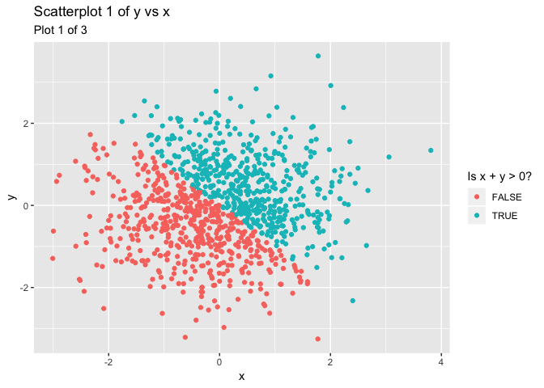
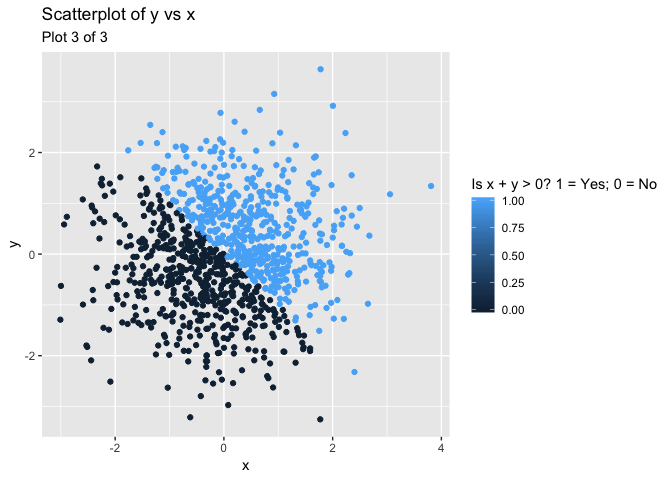

p8105\_hw1\_NC2710
================
Nicole Comfort
9/18/2018

Problem 0.1
-----------

This “problem” focuses on the use of R Markdown to write reproducible reports, GitHub for version control, and R Projects to organize your work.

To address Problem 0.1, I've:

-   Created a public GitHub repo titled p8105\_hw1\_NC2710 + local R Project

-   Created a single .Rmd file named p8105\_hw1\_NC2710.Rmd that renders to github\_document

Problem 0.2
-----------

To address Problem 0.2, I will make sure to have:

-   Meaningful variable / object names

-   Readable code (one command per line; adequate whitespace and indentation; etc)

-   Clearly-written text to explain code and results

-   A lack of superfluous code (e.g. no unused variables are defined)

Problem 1
---------

### Variable types and coercion

This problem focuses on variable types and coercion.

The code chunk below creates a data frame comprised of:

-   A random sample of size 10 from a uniform\[0, 5\] distribution

-   A logical vector indicating whether elements of the sample are greater than 2

-   A (length-10) character vector

-   A (length-10) factor vector

``` r
set.seed(1) # ensures reproducibility when using the random number generator, rnorm

prob1_df = tibble( # create data frame
  prob1_rand_sample = runif(10, min = 0, max = 5), # create a random sample of size 10 from a uniform[0,5] distribution
  prob1_vec_logical = prob1_rand_sample > 2, # create a logical vector which evalues prob1_rand_sample
  prob1_vec_char = c("This", "is", "an", "example", "character", "vector", "with", "length", "equals", "ten"), # create an example character vector of length 10
  prob1_vec_factor = factor(c("red", "orange", "yellow", "green", "blue", "cyan", "purple", "indigo", "violet", "gray")) # create a factor vector of length 10 (i.e. with 10 levels) 
)
```

*Try to take the mean of each variable in your dataframe. What works and what doesn’t? Why?*

The below code chunk attempts to take the mean of each variable in the dataframe. However, the function is only executed for the variables prob1\_rand\_sample and prob1\_vec\_logical, which are of the types numeric and logical, respectively. The mean function apparently does not work on character and factor variables.

I was surprised to see that R can indeed take the mean of a logical variable. It appears that R treats "TRUE's" as "1"s and "FALSE's" as "0's" to compute the mean.

``` r
mean(prob1_df$prob1_rand_sample) # mean works
```

    ## [1] 2.757569

``` r
mean(prob1_df$prob1_vec_logical) # mean works
```

    ## [1] 0.6

``` r
mean(prob1_df$prob1_vec_char) # mean does not work, returns NA because the argument is not numeric or logical
```

    ## Warning in mean.default(prob1_df$prob1_vec_char): argument is not numeric
    ## or logical: returning NA

    ## [1] NA

``` r
mean(prob1_df$prob1_vec_factor) # mean does not work, returns NA because the argument is not numeric or logical
```

    ## Warning in mean.default(prob1_df$prob1_vec_factor): argument is not numeric
    ## or logical: returning NA

    ## [1] NA

In some cases, you can explicitly convert variables from one type to another.

*Write a code chunk that applies the as.numeric function to the logical, character, and factor variables (please show this chunk but not the output). What happens?*

When applying as.numeric to a logical variable: Similarly to the way R treated "TRUE" and "FALSE" when applying the mean function, R converts "TRUE's" to "1"s and "FALSE's" to "0"s, returning a numeric string of 0s and 1s.

When applying as.numeric to a factor variable: R assigns a number to the position of that level when arranged alphabetically. For example, "blue" is the first level because it is the first of the colors (levels) when listed in alphabetical order (as I did not assign levels or specify ordering). Therefore, R assigns a value of "1" to "blue". Thus, when I apply as.numeric to prob1\_vec\_factor, the output is 'r as.numeric(prob1\_df$prob1\_vec\_factor)' which shows the position of each level if they were to be arranged in alphabetical order.

as.numeric will not work when applied to a character variable. It returns "NA" and a warning message. Therefore, character variables cannot be converted to numeric variables.

``` r
# eval = FALSE will show the code chunk but not the output, results are not included 

as.numeric(prob1_df$prob1_vec_logical)
as.numeric(prob1_df$prob1_vec_char)
as.numeric(prob1_df$prob1_vec_factor)
```

*In a second code chunk, convert your character variable from character to factor to numeric; similarly, convert your factor variable from factor to character to numeric. What happens?*

When converting the character variable, prob1\_vec\_char, to a factor, R creates a factor with 10 levels (because the character variable was length = 10 with 10 unique words). It organizes the levels into alphabetical order.

Then, when converting this factor variable, prob1\_char\_to\_fac, to numeric, R creates the following string of numbers: 'r print(prob1\_fac\_to\_num)'. The numbers correspond to the position that this character took on when it was organized in levels. For example, the first number in the string prob1\_fac\_to\_num is "8" because the word "This" would be in position 8 out of 10 when all the words are organized in alphabetical order as factor levels.

``` r
# convert character variable to factor
prob1_char_to_fac <- as.factor(prob1_df$prob1_vec_char)
print(prob1_char_to_fac)
```

    ##  [1] This      is        an        example   character vector    with     
    ##  [8] length    equals    ten      
    ## Levels: an character equals example is length ten This vector with

``` r
# convert factor to numeric
prob1_fac_to_num <- as.numeric(prob1_char_to_fac)
print(prob1_fac_to_num)
```

    ##  [1]  8  5  1  4  2  9 10  6  3  7

When converting the factor variable, prob1\_vec\_factor, to numeric, it doesn't look like much has changed, but in the Environment tab we can see that this variable is now a character with length=10. However, R cannot convert the character variable to numeric. The output reads "NA." It makes intuitive sense that a character cannot be converted to a numeric scale.

In summary, you can explicitly convert variables from one type to another, but this sometimes breaks down, such as when trying to convert a character to a numeric variable.

``` r
# convert factor variable to character
prob1_fac_to_char <- as.character(prob1_df$prob1_vec_factor)
print(prob1_fac_to_char)
```

    ##  [1] "red"    "orange" "yellow" "green"  "blue"   "cyan"   "purple"
    ##  [8] "indigo" "violet" "gray"

``` r
# convert character to numeric 
prob1_char_to_num <- as.numeric(prob1_fac_to_char)
```

    ## Warning: NAs introduced by coercion

``` r
print(prob1_char_to_num)
```

    ##  [1] NA NA NA NA NA NA NA NA NA NA

Problem 2
---------

### Inline R Code

This problem focuses on plotting and the use of inline R code.

The below code chunk creates a data frame comprised of:

-   x: a random sample of size 1000 from a standard Normal distribution

-   y: a random sample of size 1000 from a standard Normal distribution

-   A logical vector indicating whether the x + y &gt; 0

-   A numeric vector created by coercing the above logical vector

-   A factor vector created by coercing the above logical vector

``` r
prob2_df = tibble( # create data frame
  x = rnorm(1000, mean = 0, sd = 1), # create a random sample of size 10000 from a standard normal distribution
  y = rnorm(1000, mean = 0, sd = 1), 
  prob2_vec_logical = x + y > 0, # logical vector evaluating whether x + y > 0
  prob2_vec_num = as.numeric(prob2_vec_logical), # coerces the logical vector to numeric vector
  prob2_vec_factor = as.factor(prob2_vec_logical), # coerces the logical vector to factor vector 
)
```

The size of the dataset, prob2\_df, is 5. The mean of x is -0.0106382 and the median of x is -0.031318. The proportion of cases for which the logical vector is TRUE is 0.49.

### Scatterplot

The below code chunk makes a scatterplot of y vs x. The color differentiates whether the following is true or false: x + y &gt; 0.

``` r
# first, make a data frame to contain the variables for our plot
plot_df = tibble(
  prob2_df$x,
  prob2_df$y,
)

# make a scatterplot of y vs x
# the color scale uses the logical vector which evaluates whether x + y > 0
ggplot(plot_df, aes(x = prob2_df$x, y = prob2_df$y, color = prob2_df$prob2_vec_logical)) + geom_point()
```



``` r
# export scatterplot to project directory using ggsave
ggsave(filename = "p8105_hw1_NC2710_prob2_scatterplot.pdf")
```

    ## Saving 7 x 5 in image

*Make a second and third scatterplot that color points using the numeric and factor variables, respectively, and comment on the color scales.*

Because the numeric vector is created by coercing the logical vector (which can take the form of either TRUE or FALSE), the numeric vector contains only 0s and 1s (0s for FALSE and 1s for TRUE). Thus, while it apperas that using a numeric variable to create a color code creates a gradient scale, in this case we have only two colors because these colors correspond to "0" (black) and "1" (blue).

``` r
# make a scatterplot of y vs x
# the color scale uses the numeric vector, prob2_vec_num
ggplot(plot_df, aes(x = prob2_df$x, y = prob2_df$y, color = prob2_df$prob2_vec_num)) + geom_point()
```


As you'll see from the code chunk below, color coding by the factor vector produces the same graph as color coding by the logical vector. That is because the factor vector was created by coercing the logical vector, so essentially all that changed is the data type and that logical "TRUEs" and "FALSEs" have become stored into two levels of a factor.

``` r
# make a scatterplot of y vs x
# the color scale uses the factor vector, prob2_vec_factor
ggplot(plot_df, aes(x = prob2_df$x, y = prob2_df$y, color = prob2_df$prob2_vec_factor)) + geom_point()
```



This homework assignment was useful for exploring data types, getting introductory experience to plotting, and most importantly - learning how to commit and push to GitHub! Looking forward to learning more.

-- Nicole Comfort
